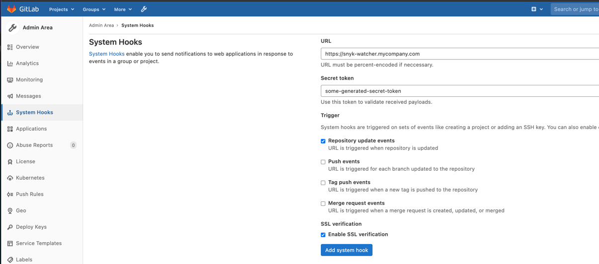
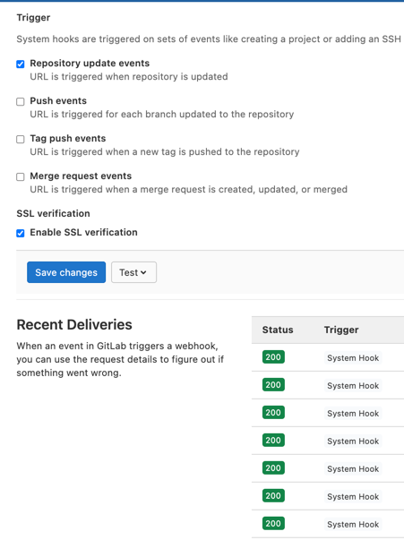
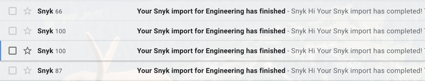

# What is snyk-watcher?

In Snyk you can add Gitlab projects, but the projects added are only a snapshot in time when you last told Snyk to
monitor the project. Thus, Snyk is not automatically updated when there are findings within your repo that you have
already fixed. For example, pyyaml may be out of date in the Snyk UI, but you may have already patched pyyaml.
Meanwhile, the Snyk UI shows pyyaml is still out of date on the repo. 

# How does it work? 

`snyk-watcher` is triggered via a Gitlab System Hook which calls an AWS Lambda via AWS API Gateway. The Lambda then 
calls the Snyk API with the project ID, which in turn updates the UI with the latest snapshot of the repo. 
This is tailored to Gitlab specifically as Github/Bitbucket's payload differs when calling Snyk. 

The Terraform included under `tf/` will deploy everything needed for you. 

# Gitlab Setup: 
- Navigate to your Gitlab instance > Admin Area > System Hooks

- Provide the URL for your new snyk-watcher API Gateway/Lambda. Note, there may need to be some pre-work to allow the 
  Gitlab instance to communicate with the API Gateway.

- Generate a new `Secret token`. This will be given to the Lambda to ensure that the triggering of the Lambda comes 
  from the Gitlab System Hook and not something random on the internet. See `src/snyk_watcher.py` `hook_validation_token`. This 
  can be passed in with the Terraform 

- The most common selection for this System Hook is "Repository Update events", but this may vary. 

- Enable SSL Verification may vary as well: 

  

- You can monitor if the System Hook is communicating correctly with your AWS API Gateway/Lambda combination using the
  "Test" button or by clicking "Edit" next to the hook. You will see Status 200's if the lambda is
  working correctly and Status `Error` or Status `503` if the lambda is not working or there's a problem interacting
  with the Snyk API:
  
  

# AWS Setup

- The Lambda will need a role specific to your AWS account. This varies depending on your AWS setup. 
  See: `tf/modules/lambda.tf` `role`
- A new CloudWatch Log Group will also be deployed with the API Gateway and the Lambda. All the logging is printed to 
  CloudWatch as opposed to a logger as loggers don't always show up in CloudWatch, while prints always do.

# Terraform Setup

`snyk-watcher` was written in Terraform 0.15.3, but it should also work with Terraform 0.12+. You may need to modify
the Terraform as needed for your organization. 

# Further Monitoring

Depending on your Snyk notification setup, emails should arrive as the Gitlab projects are imported into Snyk similar 
to below. There are also print statements that log to the CloudWatch Log Group: 

